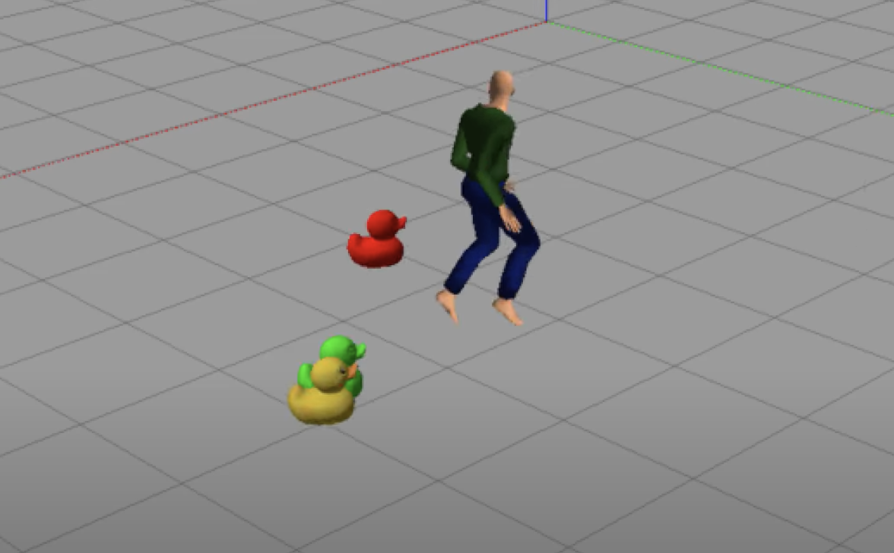

# 16.412 Final Project - Robot Planner for Human Avoidance

This project aims to develop a system for predicting human motion through a space and plan a robot trajectory to avoid the human. The class Planner provides a high level interface, which can take in robot dynamics, allowed risk, and a set of observed human trajectories, and generate the robot plan.  For an example of this interface in action, see `planner_test.py`.  
In addition to the planner itself, we use a 3D Gazebo simulation to visualize human motion and the robot avoidance.



## Installation

Run the following commands to install all the relevant packages/libraries.
```
pip3 install -r requirements.txt
sudo apt-get install python3-tk
```

Add the following to `~/.bashrc` to set the correct env variables:
```
export GAZEBO_MODEL_PATH=~/catkin_ws/src/final_proj_sim/models:/usr/share/gazebo-9/models
```

## Running the scripts

To run the planner without 3d simulations use this:
```
python3 scripts/planner_test.py
```

To run the planner **with** 3d simulations use this:
```
python3 scripts/sandbox.py
gazebo worlds/gen.world
```

